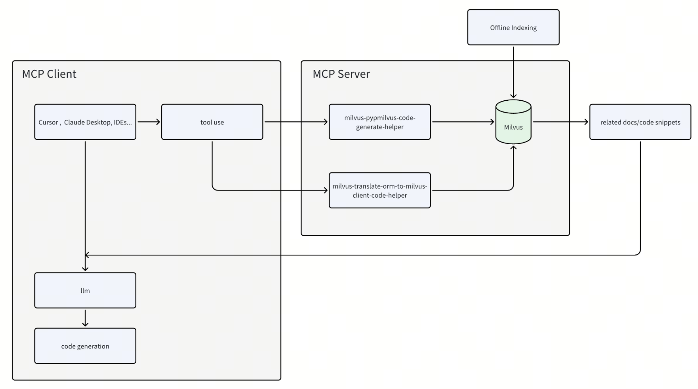

# mcp-pymilvus-code-generate-helper
> A Model Context Protocol server that retrieves relevant code snippets or documents to help generating pymilvus code.




## Prerequisites

Before using this MCP server, ensure you have:

- Python 3.10 or higher
- A running [Milvus](https://milvus.io/) instance (local or remote)
- [uv](https://github.com/astral-sh/uv) installed (recommended for running the server)

## Usage

The recommended way to use this MCP server is to run it directly with `uv` without installation. This is how both Claude Desktop and Cursor are configured to use it in the examples below. The server now support both sse and stdio:

### SSE
#### Running the Server
```shell
uv run src/mcp_pymilvus_code_generate_helper/sse_server.py
# mcp server will connect to local milvus server(http://localhost:19530) by default if no milvus_uri is provided
# to connect to a remote milvus server, you can specify the milvus_uri like this:
# uv run src/mcp_pymilvus_code_generate_helper/sse_server.py --milvus_uri http://<your-server-ip>:<your-server-port>
```
#### Usage with Cursor
1. Go to `Cursor` > `Preferences` > `Cursor Settings` > `MCP`
2. Click on the `+ Add New MCP Server` button
3. Fill out the form:
   - **Name**: `pymilvus-code-generate-helper` (or any name you prefer)
   - **Type**: Select `sse`
   - **Server URL**: `http://localhost:23333/milvus-code-helper/sse` (replace with your server's IP address)
4. Click `Save`

You can also directly edit `mcp.json` as below:
```json
{
  "mcpServers": {
    "pymilvus-code-generate-helper": {
      "url": "http://localhost:23333/milvus-code-helper/sse"
    }
  }
}
```

#### Usage with Claude Desktop
> ⚠️ Claude desktop is currently limited in its ability to connect to remote MCP servers

### STDIO
#### Running the Server
```shell
uv run src/mcp_pymilvus_code_generate_helper/stdio_server.py
# mcp server will connect to local milvus server(http://localhost:19530) by default if no milvus_uri is provided
# to connect to a remote milvus server, you can specify the milvus_uri like this:
# uv run src/mcp_pymilvus_code_generate_helper/stdio_server.py --milvus_uri http://<your-server-ip>:<your-server-port>
```
#### Usage with Cursor
1. Go to `Cursor` > `Preferences` > `Cursor Settings` > `MCP`
2. Click on the `+ Add New MCP Server` button
3. Fill out the form:
   - **Name**: `pymilvus-code-generate-helper` (or any name you prefer)
   - **Type**: Select `stdio`
   - **Command**: `/PATH/TO/uv --directory /path/to/mcp-pymilvus-code-generator run src/mcp_pymilvus_code_generate_helper/stdio_server.py`
4. Click `Save`

You can also directly edit `mcp.json` as below:
```json
{
  "mcpServers": {
    "pymilvus-code-generate-helper": {
      "command": "/PATH/TO/uv",
      "args": [
        "--directory",
        "/path/to/mcp-pymilvus-code-generator",
        "run",
        "src/mcp_pymilvus_code_generate_helper/stdio_server.py",
        "--milvus_uri",
        "http://localhost:19530"
      ],
      "env": {
        "OPENAI_API_KEY": "YOUR OPENAI API KEY HERE"
      }
    }
  }
}
```

#### Usage with Claude Desktop
1. Install Claude Desktop from https://claude.ai/download
2. Open your Claude Desktop configuration:
   - macOS: `~/Library/Application Support/Claude/claude_desktop_config.json`
3. Add the following configuration:
```json
{
  "mcpServers": {
    "pymilvus-code-generate-helper": {
      "command": "/PATH/TO/uv",
      "args": [
        "--directory",
        "/path/to/mcp-server-milvus/src/mcp_server_milvus",
        "run",
        "src/mcp_pymilvus_code_generate_helper/stdio_server.py",
        "--milvus_uri",
        "http://localhost:19530"
      ], 
      "env": {
        "OPENAI_API_KEY": "YOUR OPENAI API KEY HERE"
      }
    }
  }
}
```
4. Restart Claude Desktop
> ⚠️ Note: Remember to set the OPENAI_API_KEY environment variable

## User Rule
Here’s an additional instruction you can add for users to improve tool invocation accuracy in Cursor:
To ensure more accurate tool invocation when using Cursor, you can set a User Rule as follows:

Go to `Cursor` > `Preferences` > `Cursor Settings` > `Rules`, and add the following to your User Rule. Here is an example user rule that has proven effective for your reference:

````
Always use tools in milvus code generation, convertion and translation tasks.
1.milvus code generation.
- Can you help me generate a sample pymilvus code to hybrid search？
Call milvus_pypmilvus_code_generate_helper

2.milvus client and orm code convertion.
- Can you help me translate the following orm code to create collection to pymilvus client?
- <code context> translate to orm
Call milvus_orm_client_code_convert_helper

3.milvus code translation between different programming language.
- Can you help me translate the following milvus code to java.
- <code context> translate to nodejs
Call milvus_code_translate_helper

If you meet the milvus code translation between different programming language task or convert between orm and milvus client, you must identify all API calls of the selected codes related to the Milvus SDK. The "query" argument should be a list of API call descriptions.

Here is the examples:
Example 1
Context:
```
from pymilvus import MilvusClient, DataType

CLUSTER_ENDPOINT = "http://localhost:19530"
TOKEN = "root:Milvus"

# 1. Set up a Milvus client
client = MilvusClient(
    uri=CLUSTER_ENDPOINT,
    token=TOKEN 
)

# 2. Create a collection in quick setup mode
client.create_collection(
    collection_name="quick_setup",
    dimension=5
)

res = client.get_load_state(
    collection_name="quick_setup"
)

print(res)
```
Parsed arguments of tool using:
["create_collection", "get_load_state"]

Example 2
Context:
```
from pymilvus import MilvusClient

client = MilvusClient(uri="http://localhost:19530", token="root:Milvus")

if not client.has_collection("my_collection"):
    client.create_collection(collection_name="my_collection", dimension=128)

client.insert(
    collection_name="my_collection",
    data=[{"vector": [0.1, 0.2, 0.3, 0.4, 0.5]}]
)

client.flush(["my_collection"])
```
Parsed arguments of tool using:
["has_collection", "create_collection", "insert", "flush"]
````

Feel free to adjust or add more rules as needed for your workflow.


## Available Tools

The server provides the following tools:

- `milvus-pypmilvus-code-generate-helper`: Find related pymilvus code/documents to help generating code from user input in natural language
  - Parameters:
    - `query`: User query for generating code

- `milvus-orm-client-code-convert-helper`: Find related orm and pymilvus client code/documents to help converting orm code to pymilvus client (or vice versa)
  - Parameters:
    - `query`: A string of Milvus API names in list format from user query and code context to translate between orm and milvus client

- `milvus-code-translate-helper`: Find related documents and code snippets in different programming languages for milvus code translation
- Parameters:
    - `query`: A string of Milvus API names in list format to translate from one programming language to another (e.g., ['create_collection', 'insert', 'search'])
    - `source_language`: Source programming language (e.g., 'python', 'java', 'go', 'csharp', 'node', 'restful')
    - `target_language`: Target programming language (e.g., 'python', 'java', 'go', 'csharp', 'node', 'restful')

> ⚠️ Note: You don't need to specify the tool name or parameters in the query. Just interact as you normally would when coding with LLM: state your requirements and select the relevant code context. MCP will automatically select the appropriate tool based on the query content and prepare corresponding parameters.

## Docker
You can also build and run milvus code helper MCP server with Docker

### Build the Docker Image

```bash
docker build -t milvus-code-helper .
```

### Run the Docker Container

```bash
docker run -p <YOUR_HOST_IP>:<YOUR_HOST_PORT>:23333 -e OPENAI_API_KEY -e MILVUS_URI=<YOUR_MILVUS_URI> -e MILVUS_TOKEN=<YOUR_MILVUS_TOKEN> milvus-code-helper
```

## Contribution
Contributions are welcome! If you have ideas for improving the retrieve result, please submit a pull request or open an issue.

## License
This project is licensed under the MIT License.
